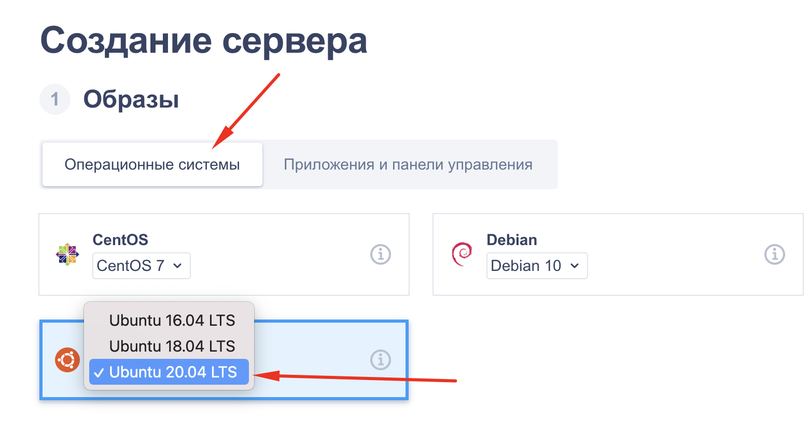
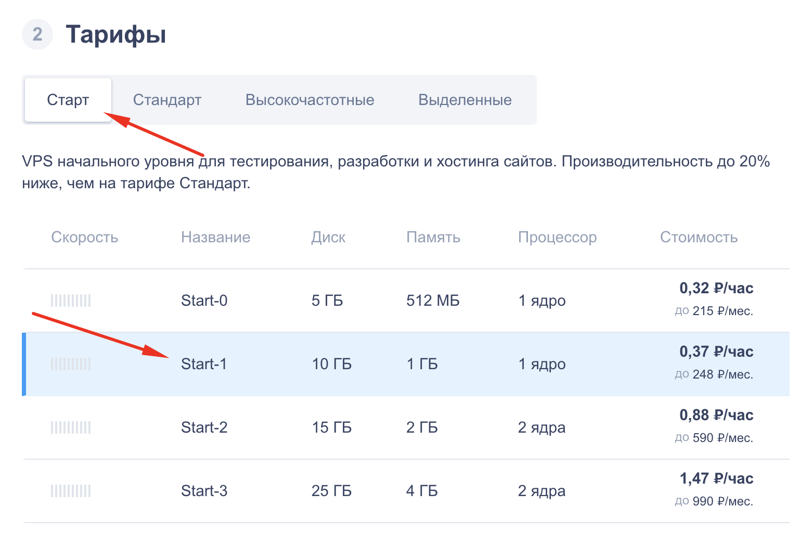
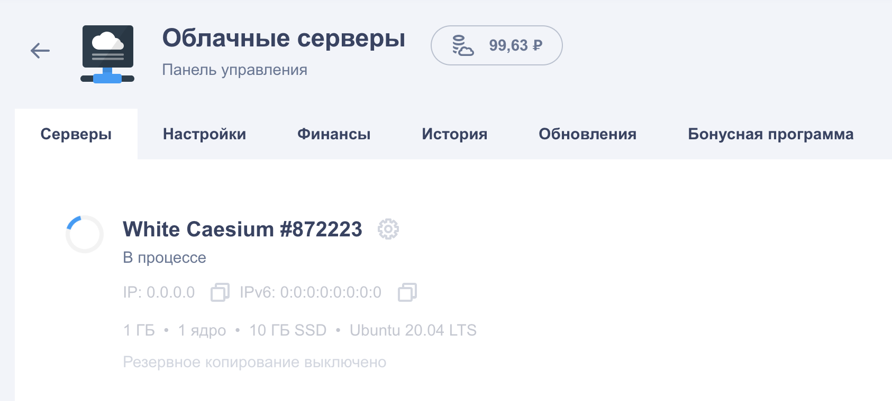

# Создание сервера на reg.ru

1. Войдите в свою учетную запись

2. Перейдите в раздел "Мои домены и услуги"

3. Перейдите в секцию "Облачные серверы"

4. Убедитесь, что на балансе имеются средства и нажмите кнопку "Создать сервер"

5. В появившемся конструкторе в первом разделе укажите операционную систему `Ubuntu 20.04 LTS`

6. В следующем разделе на вкладке "Старт" укажите тариф "Start-1"

7. Раздел 3 пропускаем (бекапы не будем использовать)

8. В последнем разделе необходимо добавить вашу **публичную** часть SSH-ключа. Название можно указат любое - оно будет отображаться только в личном кабинете на reg.ru

9. Название сервера можно указать любое - оно будует отображаться только в личном кабинете на reg.ru

10. Нажмите кнопку справа "Заказать сервер"

11. Дождитесь окончания создания сервера

12. Ваш сервер готов! На почту вам будут отправлены данные для подключения к серверу. В личном кабинете при необходимости можно узнать IP-адрес сервера и сбросить пароль
